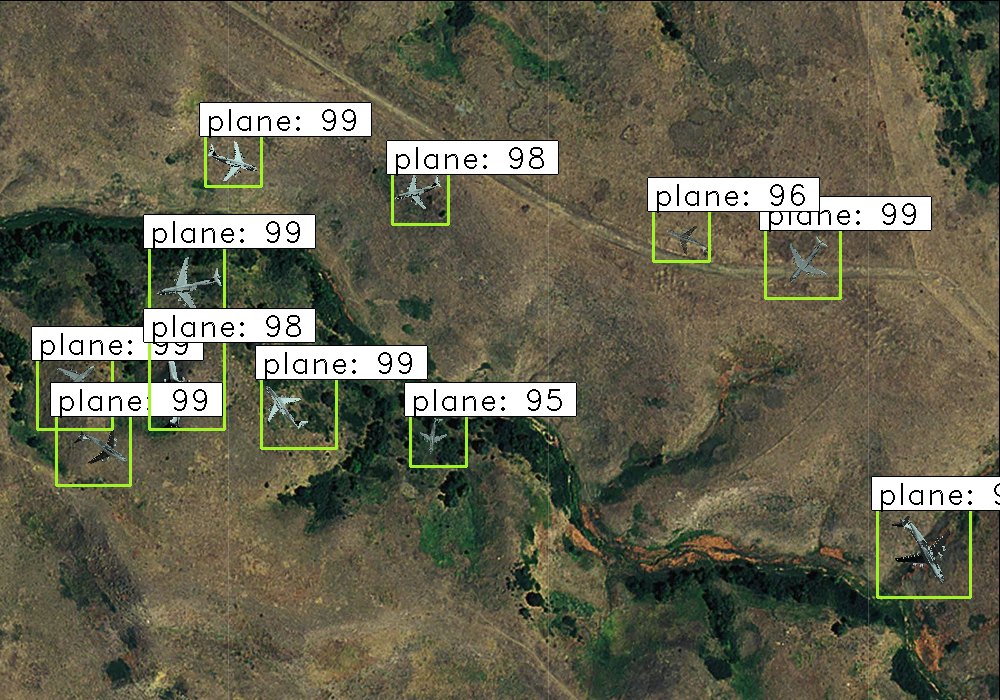

# AIRPLANE DETECTION FOR SATELLITES

Object detection is a computer technology related to computer vision and image processing that deals with detecting instances of semantic objects of a certain class (such as humans, buildings, or cars) in digital images and videos

There is a growing use of object detection in today's technology, be it face detection, face recognition, car detection, etc.

Ever since the inception of deep learning in computer vision, the object detection task has become relatively easy and less expensive in terms of computation.
Also the results from deep learning models are far better than the previous approaches.

In this github repo I have implemented Faster RCNN to detect airplanes in images taken from satellites.

## THE DATA
The data is taken from kaggle, you can find it here : https://www.kaggle.com/aceofspades914/cgi-planes-in-satellite-imagery-w-bboxes

The dataset contains 400 training images and 100 testing images, with bounding box coordinates present in both xml files or csv
In this repo I have uploaded the modified train and test csv files.

## THE APPROACH

The approach is discussed in brief here : https://medium.com/@shubhankarrawatsam.1999/airplanes-detection-for-satellite-using-faster-rcnn-d307d58353f1

Faster RCNN is one of the best object detection methods available till date.
Being an advanced version of RCNN, FRCNN gives one of the best results in less time.

It is a well known fact that deep learning models(especially computer vision ones) are highly data driven and that their accuracy is proportional to the amount of training data.
More the training data better the performance of the model.

In this problem we only have 400 images and so data augmentation is done.

augmentation.py file implements data augmentation, and saves the resulting images and bounding box coordinates in a csv.

Next the model(FRCNN) is implemented and run on the given data.

The resulting images are saved in a folder named results_imgs.
